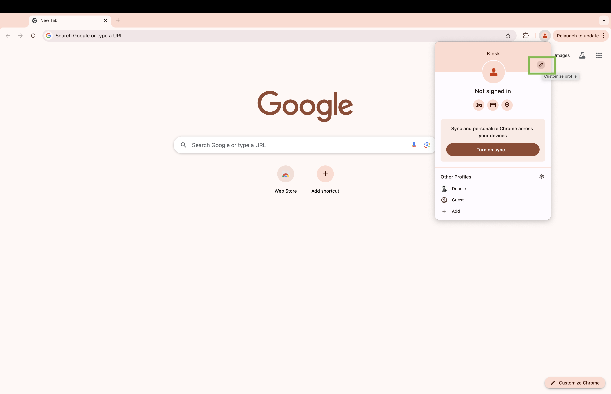

# Kiosk Mode

Set all your touchscreen web apps in Kiosk Mode in Chrome.

Kiosk mode

Follow these steps.
https://support.facilitynet.dk/hc/da/articles/360052966691-How-to-setup-Chrome-Kiosk-Mode-in-Windows-10

1. Make chrome profile. Click the profile picture then, click add.

 

2. Continue without an account.

 

3. Name your profile what you would like. 

 

4. Click the customize profile (The pencil icon).

 

5. Create a Desktop icon by clicking the switch.

 

6. In the Target add the items below after the current exe path.
 

Add --kiosk “http://ur.com” --disable-context-menu --disable-pinch

